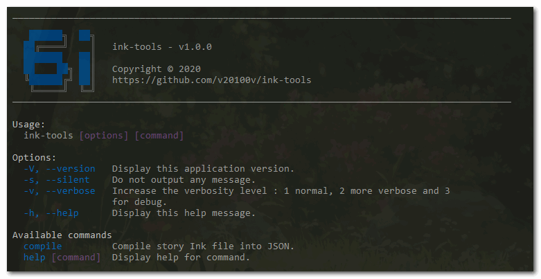

ink-to-json
===========

[](https://github.com/v20100v/6i-Jekyll/blob/develop/LICENSE.md)
[](https://www.buymeacoffee.com/vincent.blain)

> Compile inkle's story [Ink](https://github.com/inkle/ink) file into JSON, with watching mode. 



## Features
ink-to-json is a CLI application built in node.js with [commander.js](https://github.com/tj/commander.js/). It was designed in order to facilitate its integration wiht [inkjs](https://github.com/y-lohse/inkjs), the javascript implementation of inkle's ink scripting language, and to consume ink story into a web application (SPA, React, Angular ...)

ink-utils can :

- Compile a ink file into Json.
- Watch for ink file changes, in order to perform compilation each time.

## Installation

Install with [npm](https://www.npmjs.com/) or [yarn](https://yarnpkg.com/).

Global installation:
```sh
$ yarn global add @6i/ink-tools
```

As local developpement dependencies:
```sh
$ yarn add @6i/ink-tools --dev
```

Or test it with npm package runner
```sh
$ npx @6i/ink-tools 
```

## Usages

### Options

The `compile` command have many options :

| options          | description |
|------------------|-------------|
| `-s, --silent`   | Do not output any message
| `-vǀ-vvǀ-vvv, --verbose` | Increase the verbosity level : level 1 for normal information, 2 more verbose for debugging and 3 for full debug.
| `-o, --output`   | Change the output where JSON file is created.
| `-w, --watch`    | Enable watch mode, to detect if ink file has changed and start compilation each time.

### Make a single compilation

The `compile` command wait as first argument an *.ink file. Without another option, it will compil into a json file with the same name and the same folder of input ink file.

```sh
# Simple usage
$ ink-tools compile .\ink\story-basic.ink

=== Start compilation ===
[success] Inklecate compilation has finished !
```

You can add verbosity with `-v`, and change output with `--output <jsonFile>` like this :

```sh
# Change output JSON
$ ink-tools compile .\ink\story-basic.ink -v --output .\myStory.json

=== Start compilation ===
[info] Ink name file: story-basic.ink
[info] Ink path file: D:\6i\ink-tools\ink\story-basic.ink
[info] Output JSON: D:\6i\ink-tools\myStory.json
[info] Inklecate bin: D:\6i\ink-tools\bin\inklecate\inklecate_win.exe
[info] Ink compilation is starting.
[success] Inklecate compilation has finished !
```

### Watch for ink file change

To enable watch mode, just add `--watch` option in `compile` command. 

```sh
$ ink-tools compile .\ink\story-basic.ink --watch -v
```

The program can listen for ink file changes and start compilation each time it detects changement. It use an MD5 checksum of the file in order to check if the file has really changed.


### Add into a npm/yarn scripts

You can use npm/yarn as a build tool with npm scripts. They are defined in your `package.json` and allow you to run this script in console with `npm run <script>` or `yarn <script>`. Scripts can run in sequence with `yarn cmd1 && yarn cmd2`, i.e. `cmd2` won't run until `cmd1` is finished. But it can be possible to run in parallel by using another package called [concurrently](https://github.com/kimmobrunfeldt/concurrently) or [npm-run-all](https://github.com/mysticatea/npm-run-all).

You can combine for example ink-tools with [create-react-app](https://github.com/facebook/create-react-app) provides many script to run react web app in development mode, test it or build for production, like this :

```json
// package.json

(...)
"scripts": {
    "start": "concurrently -n INK-TOOLS,REACT -c \"bgBlue.bold,bgMagenta.bold\" \"yarn ink-watch\" \"react-scripts start\" ",
    "build": "yarn ink-compile && react-scripts build",
    "test": "yarn ink-compile && react-scripts test",
    "eject": "react-scripts eject",
    "ink-compile": "./node_modules/.bin/ink-tools.cmd compile ./ink/my-story.ink",
    "ink-watch": "./node_modules/.bin/ink-tools.cmd compile ./ink/my-story --watch"
  }, 
```

So in development mode, the ink file is compiled before running test `yarn test`, before build application for production `yarn build` and each time is changed in developpement mode `yarn start`.

## Ink story

[Ink](http://www.inklestudios.com/ink) is [inkle](http://www.inklestudios.com)'s scripting language for writing interactive narrative, both for text-centric games as well as more graphical games that contain highly branching stories. It's designed to be easy to learn, but with powerful enough features to allow an advanced level of structuring.

## License
Release under [MIT](./LICENSE.md) license.

This soft is free and available as open source under the terms of the [MIT License](./LICENSE.md), but if you want to support me, you can [buy me a coffee here](https://www.buymeacoffee.com/vincent.blain) !

## Copyright
Copyright (c) 2020 by 2o1oo <vb20100bv@gmail.com>
